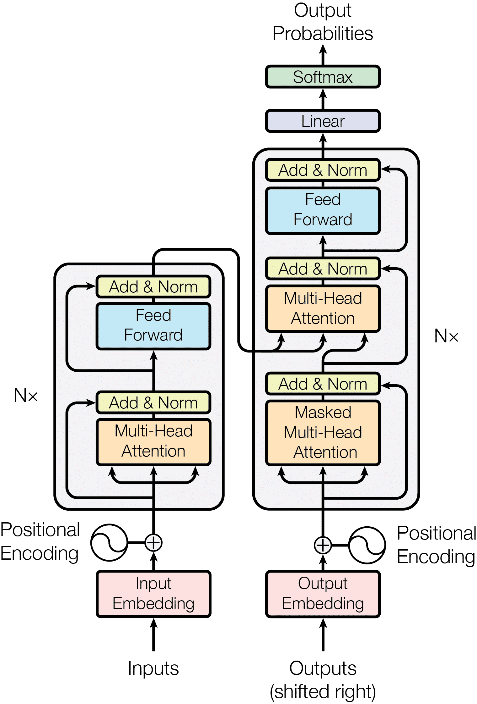

# Les 3: Transformers

## Word embeddings
- obv betekenis, context aan tokens geven (multidimensionale representatie van de features)

## Transformers
**Attention:** bereken voor ieder woord (Q/Query) hoeveel dat woord relateert aan ieder ander woord in de zin (K/Key). Gebruik deze scores als weging om het volgende woord (V) te voorspellen.

> “ananas op pizza is vies”
$$
1 \times 4 \times 1 \times 4 \times 1 = 29
$$
$$
2 \times 5 \times 2 \times 5 \times 3 =
$$
$$
3 \times 5 \times 4 \times 6 \times 3 =
$$

Berekenen van de “attention score” op alle andere woorden.

Je kan dus per woord in de zin een aparte (cuda)thread aftrappen om de relaties tussen de woorden te bereken.

Het linker deel van het plaatje is niet relevant voor chatmodellen, maar wel voor vertalers.

## Positional encodings
Ipv trigonometrie, een soort identiteitsmatrix.

## Lagen
Hoe meer lagen, hoe meer nuances, dus dan geeft hij meer context aan de woorden.
